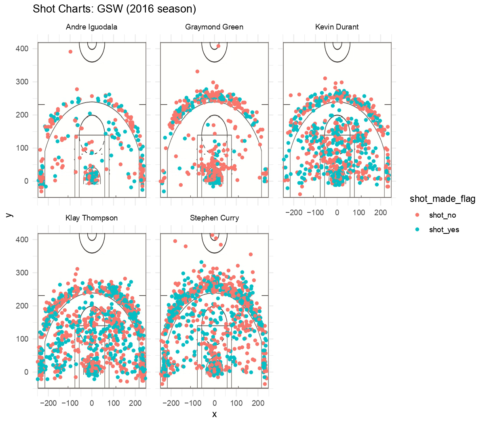

# 5.1) Effective Shooting Percentage

## Labeling Shot_did and Shot_made
```{r}
library(dplyr)
assemble <- read.csv("../data/shots-data.csv")
assemble$shot_did <- 1
assemble$shot_made <- 0;assemble$shot_made[assemble$shot_made_flag=='shot_yes'] <- 1
```

## 2PT Effective Shooting % by Player
```{r}
shot_2 <- filter(assemble, assemble$shot_type == "2PT Field Goal")
table_2 <- arrange(summarise(group_by(shot_2,name), total = sum(shot_did), made = sum(shot_made), perc_made = sum(shot_made)/sum(shot_did)),desc(perc_made))
table_2
```

## 3PT Effective Shooting % by Player
```{r}
shot_3 <- filter(assemble, assemble$shot_type == "3PT Field Goal")
table_3 <- arrange(summarise(group_by(shot_3,name), total = sum(shot_did), made = sum(shot_made), perc_made = sum(shot_made)/sum(shot_did)),desc(perc_made))
table_3
```

## Effective Shooting % by Player
```{r}
shot <- assemble
table <- arrange(summarise(group_by(shot,name), total = sum(shot_did), made = sum(shot_made), perc_made = sum(shot_made)/sum(shot_did)),desc(perc_made))
table
```

## Facetted Shot Charts

```{r out.width = '80%', echo = FALSE, fig.align = 'center'}

```


# 5.2) Narratives:
# Who is the Most Effctive Shooting Player of GSW in 2016 NBA Session?
In the past 2016 NBA session, the Golden State Warriors team has caught great attention for its excellent shooting performance. Among them, Andre Iguodala, Graymond Green, Kevin Durant, Klay Thompson, Stephen Curry stand out most. \
In this article, we are going to find which of the brilliant stars is the most effctive shooting player, through plots presentation and data analysis. \


> Resource Reference: <https://www.basketball-reference.com/teams/GSW/>

### Overview Plot
At the very beginning, we'd like to have an overview of The five players' shooting perfermance in 2016 NBA session. A vivid picture is shown below:

```{r out.width = '80%', echo = FALSE, fig.align = 'center'}

```
As we can see from the points densities, total shots differ a lot among players: Kevin Durant, Klay Thomspon and Stephen Curry shot much more than Andre Iguodala and Graymond Green. \
However, what counts most is the effectiveness of shooting, which can be displayed as the percentage of green points in the chart. From this angle, we find that in Greaymond Green's chart, there are significantly more red points than green ones. Based on this, we suppose Green is not the most effective shooting player.

### Statistics Table

So exactly which person performs best in effective shooting? To further discuss about that,There is a need to refer to statistics analysis.\
Firstly, we consider the general effective shooting (percentage of shots made in the total shots tried), no matter it accounts for 2 points or 3 points. From this point of view, we summarise the five players' shots made percentages and derive a descending order table:
```{r}
assemble <- read.csv("../data/shots-data.csv")
assemble$shot_did <- 1
assemble$shot_made <- 0;assemble$shot_made[assemble$shot_made_flag=='shot_yes'] <- 1
shot <- assemble
table <- arrange(summarise(group_by(shot,name), total = sum(shot_did), made = sum(shot_made), perc_made = sum(shot_made)/sum(shot_did)),desc(perc_made))
table
```
From this table above, we take Kevin Durant as the most efficive shooting player. Because he got the highest perc_made, which comes from 495 successful shots in 915 tries.\

Nevertheless, in most cases, we care more about the shooting effectiveness of 3-points-field-guard shots. So next, we are going to evaluate the shooting effectiveness only by 3-points-field-guard shots. Based on the selected statistcs, similarly, we get the summarised and sorted table:
```{r}
shot_3 <- filter(assemble, assemble$shot_type == "3PT Field Goal")
table_3 <- arrange(summarise(group_by(shot_3,name), total = sum(shot_did), made = sum(shot_made), perc_made = sum(shot_made)/sum(shot_did)),desc(perc_made))
table_3
```

Clearly shown in the table, Klay Thompson ranks first, from the perspective of 3-points-field-guard effecitive shooting. \
**The result is differnt from the previous table, but we value this rank more, bacause 3-points-shot-made-percentage can better describe a player' skills level and contributes more to a final win. **\

Another thing indicated is that the 3-points-field-guard shots-made-percentage are lower than the whole shots-made-percentage, simply because making a 3 points shot is more chanllenging. To have a cleaer comprision, we also draw the 2-points shots-made-percentage table:
```{r}
shot_2 <- filter(assemble, assemble$shot_type == "2PT Field Goal")
table_2 <- arrange(summarise(group_by(shot_2,name), total = sum(shot_did), made = sum(shot_made), perc_made = sum(shot_made)/sum(shot_did)),desc(perc_made))
table_2
```
Evidently, for each plaer, the 2-points shots-made-percentages is higher. Because compared with 3 points shot, a 2 points shot made is much easier and more common.

### Summary and Conclusion

To summarise, we first had a visual overview of the five payers' shooting perfermance, find that total shots differ a lot among players and Graymond Green is not the most effective shooting player(Because in his chart, red points take evidently greater part than green ones) . Further, we analysis the shot-made-percentage ranking from both all the shots and only the 3-points-field-guard shots.\
Through the plots and tables, we arrive at the final conlusion:
**From the 3-points-field-guard perspective, Klay Thomson is the most effictive player of GSW in NBA 2016. **\


